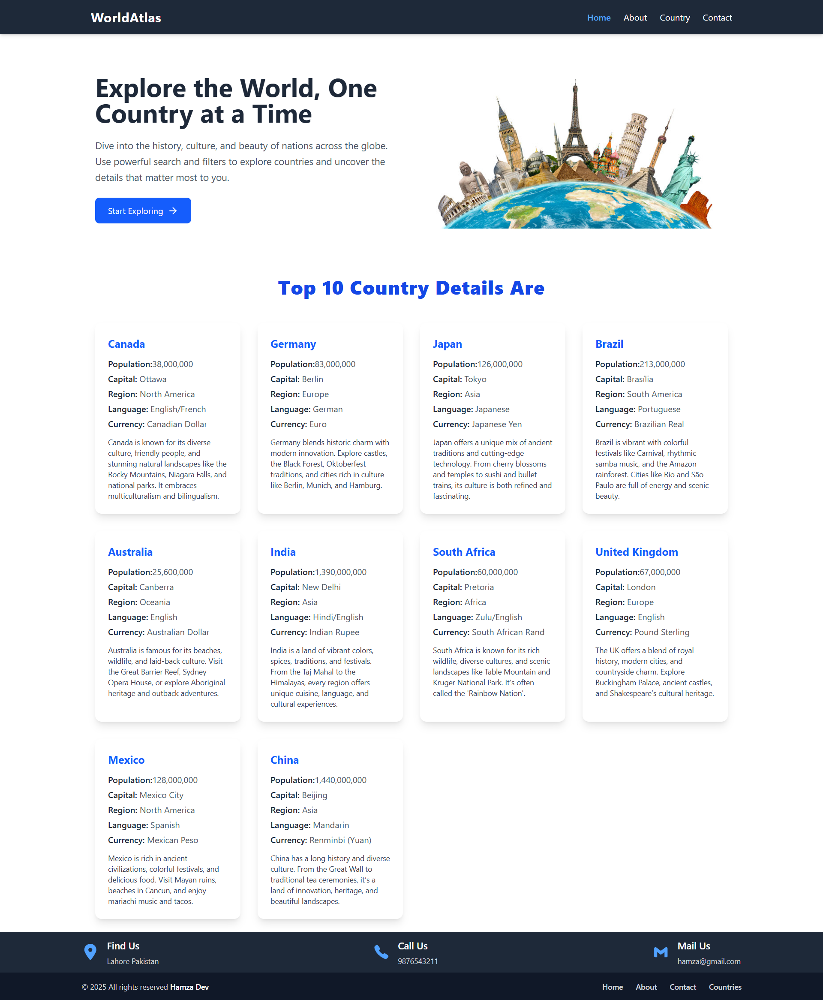
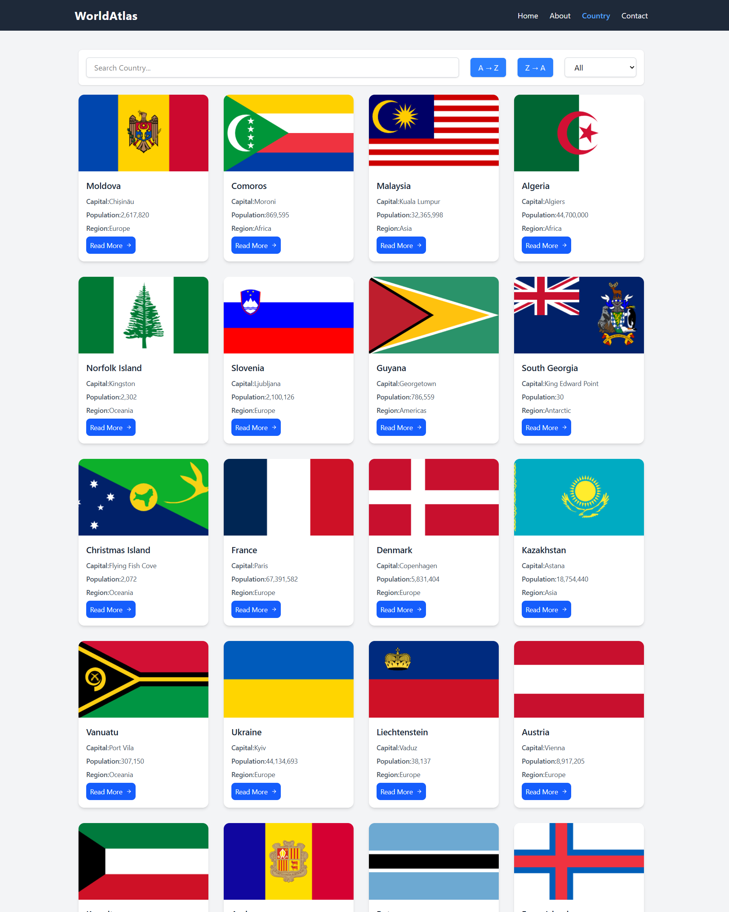

# 🌍 GlobeVista

GlobeVista is a responsive React app that displays information about countries using the [REST Countries API](https://restcountries.com/). Users can view flags, capitals, populations, regions, and more — with built-in search, filter, and sorting functionality.

---

## 🚀 Features

- 🌐 Fetches live data from REST Countries API
- 🔍 Search countries by name
- 🗂️ Filter countries by region (Asia, Europe, etc.)
- 🔠 Sort countries A → Z and Z → A
- 📱 Fully responsive layout for all screen sizes
- 🎌 Country detail page with flag, currency, languages, and more

---

## 🖼️ Screenshot

### 🏠 Home Page:

### 🌍 Countries Page:

---

## ⚙️ Tech Stack

- React.js
- Tailwind CSS
- REST Countries API
